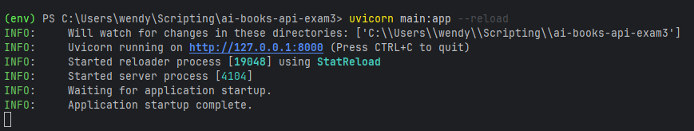
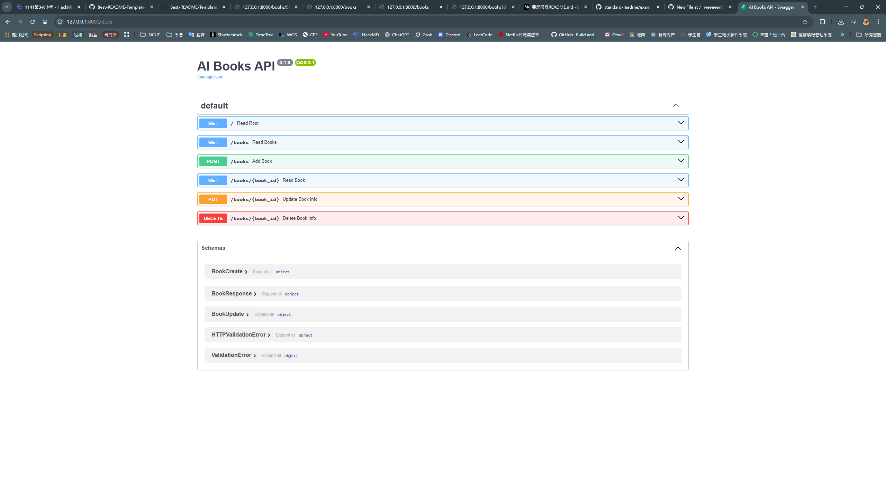
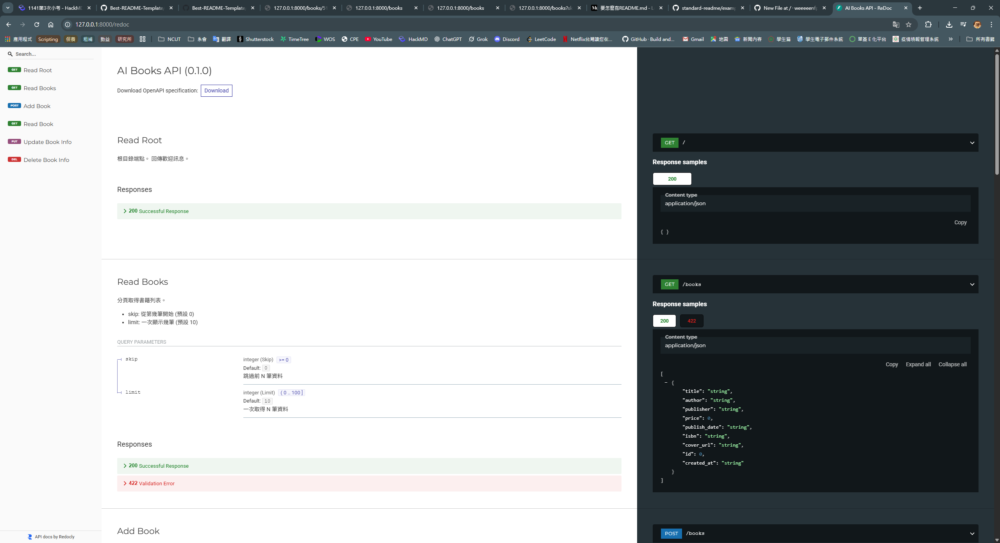
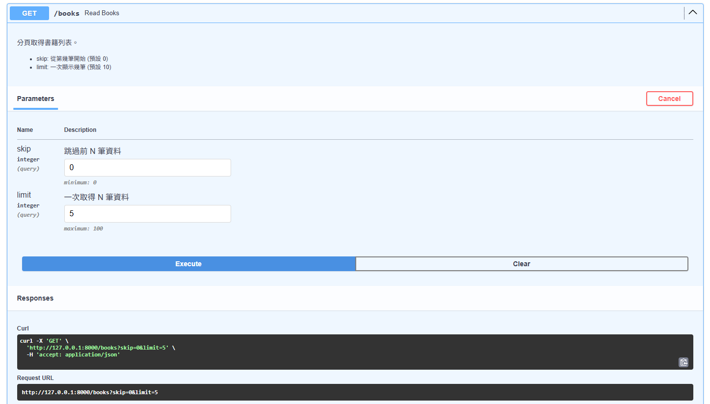
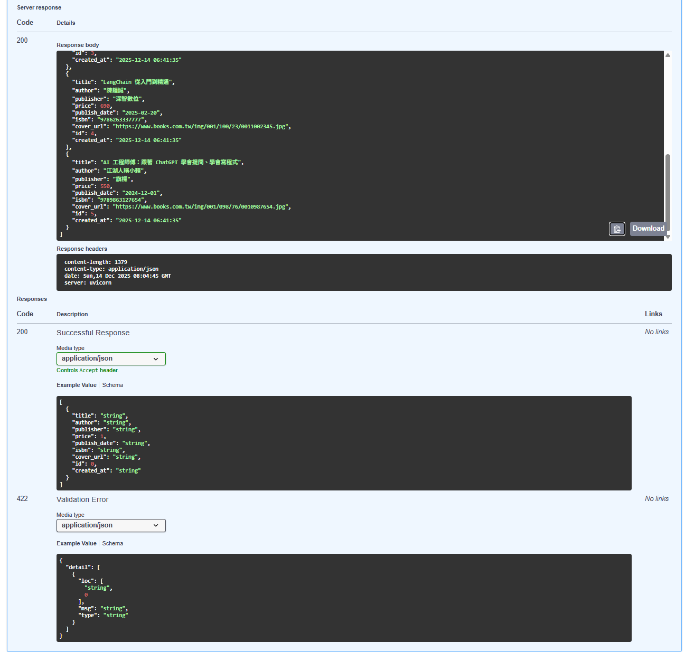
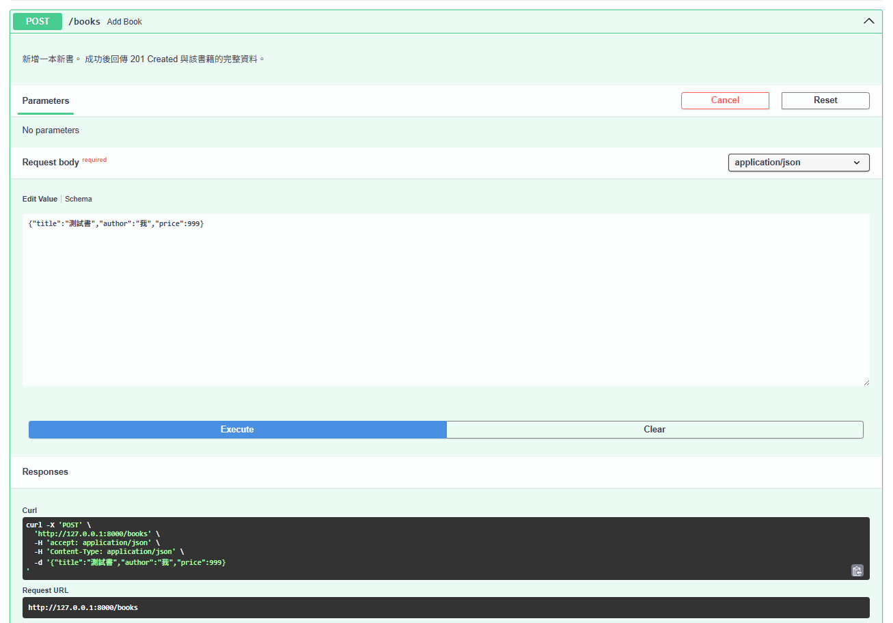
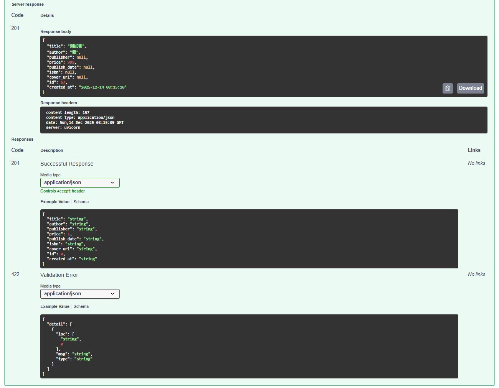
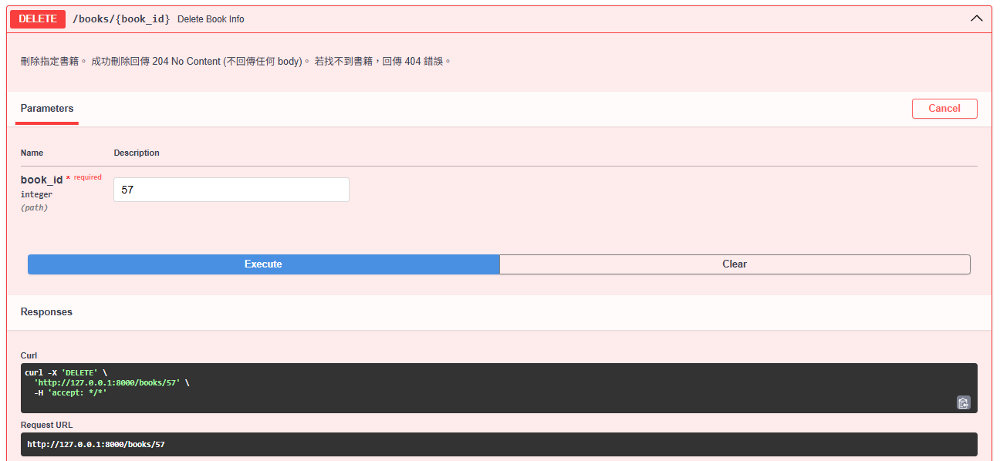
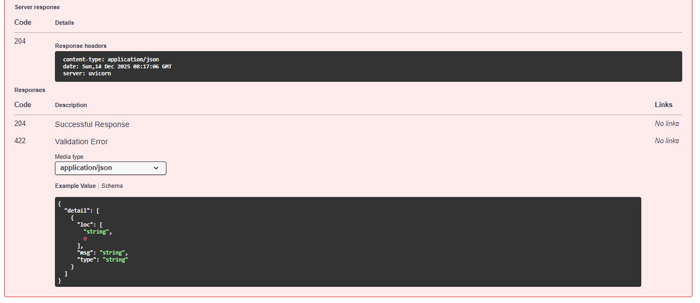

# Title

第三次小考 

博客來 AI 書籍管理 API（FastAPI 實作）


## Usage

```
uvicorn main:app --reload

```

## 執行結果圖片(POSTMAN)
1. **uvicorn main:app --reload 啟動畫面**

2. **Swagger UI（/docs）**

3. **ReDoc (/redoc) **

4. **POSTMAN測試**
* GET /books


* POST


* DELETE 



## License

MIT © Richard McRichface